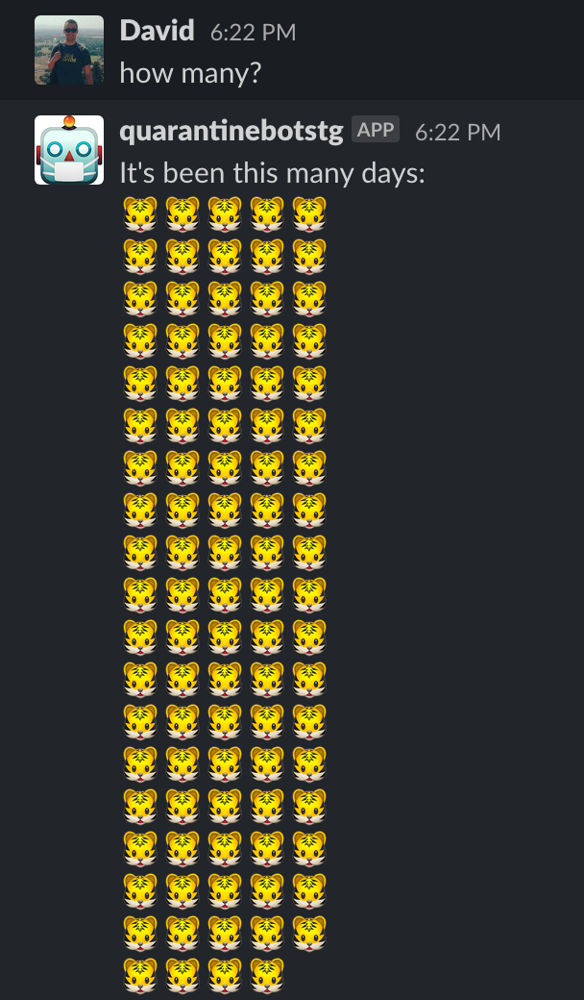

# quarantinebot

Slack bot which tells you how long you've been quarantined in units of facemasks.

* Written in Kotlin
* Built with the blazing-fast [Micronaut](https://micronaut.io/) framework



# Creating a Slack bot

Create an app via https://api.slack.com/. Add it to your workspace.

## Event subscriptions

Subscribe to bot events: `app_mention`, `message.channels`, and `message.im`.

## Permissions

Add scopes for `app_mentions:read`, `im:history`, and `chat:write`.

## Bots

Enable `Always Show My Bot as Online`.

# Running tests locally

1. Do a `./gradlew build` to generate kapt annotations.
2. Run tests as usual in IntelliJ.

# Running application locally

Included in the build is Micronaut's Netty server.
Invoke `./gradlew run` to start it on port 8080. 
Make sure to set the `SLACK_TOKEN` environment variable to your Slack app's token.

# Running application in Docker

Included is a multistage Dockerfile which builds a 
minimal OpenJDK11 container.

1. `docker build . -t quarantinebot`
2. `docker run -p8080:8080 quarantinebot`

# Health check endpoints

I included health check endpoints accessible at "/health"
which returns a JSON payload:
```json
{
  "status": "UP"
}
```

# Deployment

In production, I run this on [Google Cloud Run](https://cloud.google.com/run).

I have a Cloud Build trigger set up on pushes to the master branch of this repo that automatically deploys it.